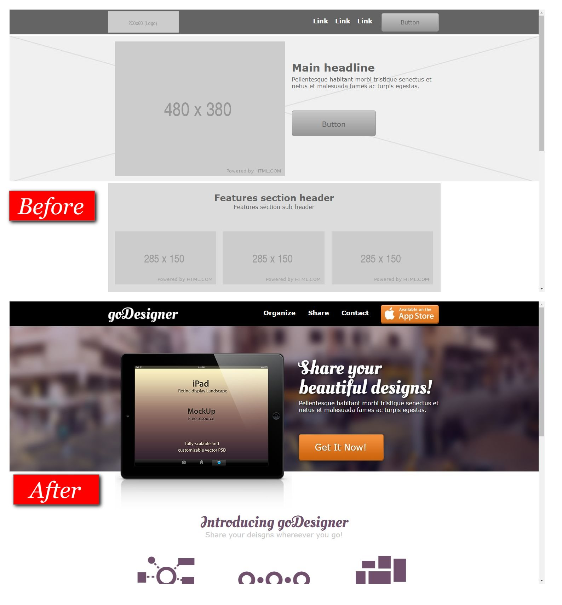

# GoDesigner App

> Part 2 of HTML wireframes; applying designs in CSS
---
### Link To Project
See the [[Project name on Netlify]]([netlify-url]) on Netlify.
---
### Table of Contents
Breakdown of this readme file.
- [Description](#description)
- [How To Use](#how-to-use)
- [References](#references)
- [License](#license)
- [Author Info](#author-info)
---
## Description
This was part 2 of Geoff Blake’s courses, the first was called “Website Wireframing with HTML5 & CSS3” where we made the wireframe layout. This course picks up from there to learn applying CSS styles to the wireframe. 
It was generally very easy to learn, building as a responsive site was out of the scope of this small course, but it is touched on. 
A lot of interesting links were given to help design things in CSS. 
The styling came with images needed but also explained how to find those images. 
Gave this a 4.5 star rating and could have been improved by using vscode and updating some of the websites that were referenced. Such as the old Yahoo developer kit which no longer exists. 
   
Project based on [Applying Design To Wireframes with HTML5 & CSS3]( https://www.udemy.com/course/applying-design-to-wireframes-with-html5-css3/)
#### Technologies
- HTML5
- CSS3
[Back To The Top](#godesigner-app)
---
## How To Use
#### Installation
Simple single page. 

#### API Reference
None

[Back To The Top](#godesigner-app)
---
## References
none
[Back To The Top](#godesigner-app)
---
## License

MIT License
Copyright (c) [2020] [Bryan Lundeen]
Permission is hereby granted, free of charge, to any person obtaining a copy
of this software and associated documentation files (the "Software"), to deal
in the Software without restriction, including without limitation the rights
to use, copy, modify, merge, publish, distribute, sublicense, and/or sell
copies of the Software, and to permit persons to whom the Software is
furnished to do so, subject to the following conditions:
The above copyright notice and this permission notice shall be included in all
copies or substantial portions of the Software.
THE SOFTWARE IS PROVIDED "AS IS", WITHOUT WARRANTY OF ANY KIND, EXPRESS OR
IMPLIED, INCLUDING BUT NOT LIMITED TO THE WARRANTIES OF MERCHANTABILITY,
FITNESS FOR A PARTICULAR PURPOSE AND NONINFRINGEMENT. IN NO EVENT SHALL THE
AUTHORS OR COPYRIGHT HOLDERS BE LIABLE FOR ANY CLAIM, DAMAGES OR OTHER
LIABILITY, WHETHER IN AN ACTION OF CONTRACT, TORT OR OTHERWISE, ARISING FROM,
OUT OF OR IN CONNECTION WITH THE SOFTWARE OR THE USE OR OTHER DEALINGS IN THE
SOFTWARE.

[Back To The Top](#godesigner-app)
---
## Author Info
- Github - [lundeen-bryan](https://github.com/lundeen-bryan)
- LinkedIn - [BryanLundeen](https://www.linkedin.com/in/bryanlundeen/)
[Back To The Top](#godesigner-app)

